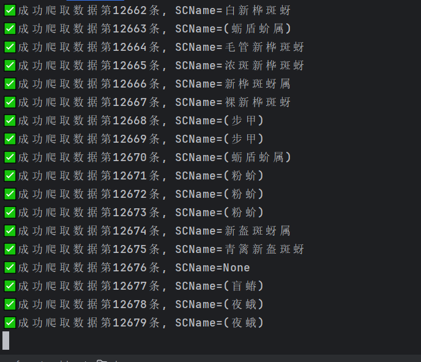

<p align="center">
    <a href="https://github.com/Azure12355/deep-forest-spider" target="_blank">
      
    </a>
</p>

<h1 align="center">Deep-Forest-Spider</h1>
<p align="center">
  <strong>一个基于 Scrapy 的分布式林业病虫害数据采集与处理系统 🕷️🌿</strong>
  <br>
  为 <a href="https://github.com/Azure12355/deep-forest">DeepForest</a> 智能问答系统提供高质量、结构化的数据源。
</p>

<div align="center">
    <a href="https://github.com/Azure12355/deep-forest-spider/blob/master/LICENSE" target="_blank">
        
    </a>
    <a href="https://github.com/Azure12355/deep-forest-spider" target="_blank">
        
    </a>
    <a href="https://github.com/Azure12355/deep-forest-spider/issues" target="_blank">
        
    </a>
    <a href="https://scrapy.org/" target="_blank">
        
    </a>
     <a href="https://www.python.org/" target="_blank">
        
    </a>
</div>

## 🎯 项目目标

`deep-forest-spider` 是一个专为林业领域设计的、功能完备的数据工程项目。其核心目标是构建一个自动化的 **ETL (Extract, Transform, Load)** 管道，为 [DeepForest 智能问答系统](https://github.com/Azure12355/deep-forest) 提供结构化、干净、可用的数据。

整个项目流程清晰地划分为三个阶段：

1.  **数据提取 (Extract)**: 使用 **Scrapy** 框架从目标网站（pestchina.com）的多个 API 端点并发爬取林业病虫害相关的原始数据，并以 JSON 格式分批存储。
2.  **数据转换 (Transform)**: 运行一系列独立的 Python 清洗脚本，对原始 JSON 数据进行解析、验证、字段映射和格式化，最终生成符合数据库规范的 CSV 文件。
3.  **数据加载 (Load)**: 执行数据导入脚本，将清洗后的 CSV 文件高效、安全地批量导入到 **MySQL** 数据库中，为上层应用提供数据支持。

## ✨ 项目特点

*   **模块化爬虫设计**: 针对不同的数据接口设计了 **11 个独立的 Scrapy 爬虫**，每个爬虫职责单一，易于维护和扩展。
*   **清晰的数据流**: `原始数据 (JSON)` -> `清洗后数据 (CSV)` -> `数据库 (MySQL)` 的数据流向清晰明确，每个阶段都有独立的脚本和目录。
*   **健壮的数据清洗**: `data_cleaning` 模块包含了详细的数据验证（如 UUID、日期格式）和转换逻辑，确保了入库数据的质量。
*   **高效的数据导入**: `data_transfer` 模块使用 `pandas` 和 `SQLAlchemy` 等库进行批量数据导入，并包含进度条、日志和错误处理机制。
*   **完整的数据库 Schema**: `sql/deep_forest.sql` 文件提供了完整的数据库表结构，包括索引和注释，便于快速搭建数据库环境。
*   **分布式就绪**: 项目在设计上已为 `scrapy-redis` 留出接口，可以轻松扩展为分布式爬虫，以应对更大规模的数据采集需求。

### 运行截图



## 🛠️ 技术栈

| 技术            | 说明                     | 官网/文档                                                      |
| --------------- | ------------------------ | -------------------------------------------------------------- |
| **核心框架**    |                          |                                                                |
| Python 3.9+     | 编程语言                 | [python.org](https://www.python.org/)                          |
| Scrapy          | 高性能爬虫框架           | [scrapy.org](https://scrapy.org/)                              |
| **数据处理**    |                          |                                                                |
| Pandas          | 数据分析与处理库         | [pandas.pydata.org](https://pandas.pydata.org/)                |
| **数据库**      |                          |                                                                |
| MySQL           | 目标关系型数据库         | [mysql.com](https://www.mysql.com/)                            |
| PyMySQL         | Python MySQL 驱动        | [github.com/PyMySQL/PyMySQL](https://github.com/PyMySQL/PyMySQL) |
| SQLAlchemy      | SQL 工具包和 ORM         | [sqlalchemy.org](https://www.sqlalchemy.org/)                  |
| **辅助工具**    |                          |                                                                |
| tqdm            | 终端进度条库             | [github.com/tqdm/tqdm](https://github.com/tqdm/tqdm)           |

## 🚀 快速运行指南

请遵循以下步骤，在您的本地环境中完整地运行整个数据处理流程。

### 1. 环境准备

*   **Python**: 确保已安装 Python 3.9 或更高版本。
*   **MySQL**: 确保已安装并运行 MySQL 数据库服务。
*   **(可选) Redis**: 如果您想启用分布式爬取，请安装并运行 Redis 服务。

### 2. 初始化项目

```bash
# 1. 克隆项目
git clone https://github.com/Azure12355/deep-forest-spider.git
cd deep-forest-spider

# 2. 创建并激活虚拟环境 (推荐)
python -m venv venv
# Windows
# venv\Scripts\activate
# macOS / Linux
# source venv/bin/activate

# 3. 安装依赖
# 注意：requirements.txt 文件可能存在编码问题，请确保其为 UTF-8 格式
# 如果安装失败，请手动安装: pip install scrapy pandas sqlalchemy pymysql tqdm
pip install -r requirements.txt
```

### 3. 初始化数据库

1.  登录到您的 MySQL 数据库。
2.  创建一个新的数据库，例如 `deep_forest`。
    ```sql
    CREATE DATABASE deep_forest CHARACTER SET utf8mb4 COLLATE utf8mb4_unicode_ci;
    ```
3.  执行 `sql/deep_forest.sql` 文件中的所有 SQL 语句，以创建所有必需的数据表。
    ```bash
    # 示例命令 (请替换为您的用户名)
    mysql -u your_username -p deep_forest < sql/deep_forest.sql
    ```

### 4. 运行数据处理流水线

整个流程分为三步，请按顺序执行。

#### **第 1 步: 数据爬取 (Extract)** 🕸️

进入爬虫项目目录并运行所有爬虫。您可以选择性地运行单个爬虫。

```bash
cd dp_spider

# 运行所有爬虫 (会按顺序执行，但建议逐个运行以控制流程)
# 这是一个示例，实际项目中您需要手动按依赖顺序运行
scrapy crawl pests_spider # 1. 获取物种 ID 列表
scrapy crawl meta_info_spider # 2. 获取物种元信息
# ... 运行其他爬虫 ...
```
> **💡 建议的爬虫运行顺序** (确保前一个爬虫的输出是下一个的输入):
> 1.  `pests_spider` (生成 `species_id` 文件)
> 2.  基于 `species_id` 运行所有其他爬虫，例如:
>     *   `meta_info_spider`
>     *   `species_distribution_spider`
>     *   `species_host_spider`
>     *   等...

爬取完成后，原始数据将以 JSON 格式保存在 `dp_spider/data/` 目录下。

#### **第 2 步: 数据清洗 (Transform)** 💧

运行 `data_cleaning` 目录下的所有 Python 脚本，将原始 JSON 数据转换为干净的 CSV 文件。

```bash
# 回到项目根目录
cd ..

# 逐个运行清洗脚本
python dp_spider/data_cleaning/species_meta_info.py
python dp_spider/data_cleaning/species_distribution.py
# ... 运行所有其他清洗脚本 ...
```
清洗完成后，结构化的 CSV 文件将保存在 `dp_spider/cleaned_data/` 目录下。

#### **第 3 步: 数据导入 (Load)** 🚚

最后，运行 `data_transfer` 目录下的脚本，将 CSV 数据导入到 MySQL 数据库中。

**重要**: 在运行前，请确保已修改 `data_transfer` 目录下每个导入脚本中的 `DB_CONFIG` 字典，使其与您的数据库配置一致。

```python
# data_transfer/import_*.py

DB_CONFIG = {
    'host': 'your_host',      # e.g., 'localhost'
    'port': 3306,
    'user': 'your_username',
    'password': 'your_password',
    'database': 'deep_forest',
    'charset': 'utf8mb4'
}
```

修改完成后，逐个运行导入脚本：
```bash
python dp_spider/data_transfer/import_species.py
python dp_spider/data_transfer/import_species_distribution.py
# ... 运行所有其他导入脚本 ...
```
每个导入脚本都会显示进度条，并在完成后打印统计信息。所有脚本成功运行后，您的数据库就填充完毕了！

## 📂 项目结构

```
deep-forest-spider/
├── dp_spider/
│   ├── data/                 # 存放爬取到的原始 JSON 数据
│   ├── cleaned_data/         # 存放清洗后的结构化 CSV 数据
│   ├── data_cleaning/        # 🧹 数据清洗脚本 (Transform)
│   ├── data_transfer/        # 🚚 数据导入脚本 (Load)
│   └── dp_spider/
│       ├── spiders/          # 🕷️ Scrapy 爬虫定义 (Extract)
│       ├── items.py          # Scrapy Item 定义
│       ├── pipelines.py      # Scrapy Pipeline 定义 (数据存储)
│       └── settings.py       # Scrapy 配置文件
├── sql/
│   └── deep_forest.sql       # 数据库表结构定义
├── LICENSE
├── README.md
└── requirements.txt        # Python 依赖
```

## 🤝 贡献

我们非常欢迎社区的贡献！如果您有任何改进建议、发现了 Bug，或者想添加新的爬虫，请：

1.  Fork 本仓库。
2.  创建一个新的特性分支。
3.  完成您的修改和测试。
4.  提交一个 Pull Request，并详细描述您的更改。

## 📄 开源许可证

本项目采用 [MIT License](./LICENSE) 授权。